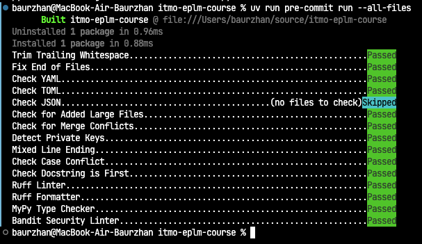
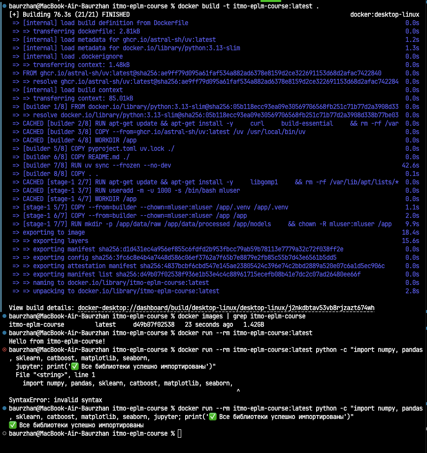
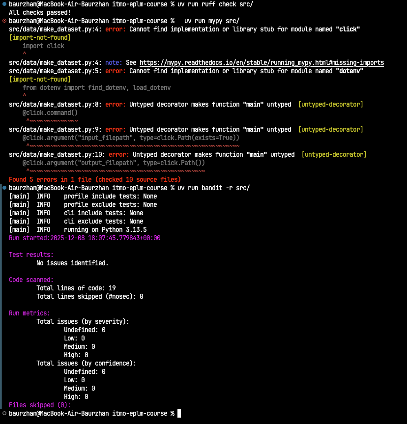

# Отчёт о настройке рабочего места Data Scientist

## Обзор

Проект **ITMO EPLM Course** — полнофункциональное рабочее место для Data Science с использованием современных инженерных практик.

**Версия:** 0.1.0
**Python:** 3.13
**Пакетный менеджер:** UV

---

## 1. Структура проекта (БЛОК 1)

### Инструмент: Cookiecutter Data Science

**Описание:** Стандартизированная структура для ML/DS проектов.

**Структура проекта:**
```
itmo-eplm-course/
├── data/                  # Данные (raw, processed, interim, external)
├── notebooks/             # Jupyter notebooks
├── src/                   # Исходный код
│   ├── main.py
│   └── data/
│       └── make_dataset.py
├── tests/                 # Тесты
├── reports/               # Отчёты и visualizations
├── pyproject.toml         # Конфигурация проекта и зависимости
├── README.md              # Документация проекта
├── Dockerfile             # Контейнеризация
├── docker-compose.yml     # Оркестрация контейнеров
└── docs/                  # Техническая документация
```

**Результат:** ✅ Структура создана и готова к использованию

---

## 2. Инструменты качества кода (БЛОК 2)

### 2.1 Ruff — Линтер и форматтер

**Назначение:** Быстрая проверка и автоматическое форматирование Python кода.

**Конфигурация (pyproject.toml):**
```toml
[tool.ruff]
line-length = 100
target-version = "py313"

[tool.ruff.lint]
select = ["E", "W", "F", "I", "N", "B", "UP"]

[tool.ruff.format]
quote-style = "double"
```

**Команды:**
```bash
uv run ruff check src/          # Проверка
uv run ruff format src/         # Форматирование
```

**Результат:** ✅ Установлен и настроен в pre-commit hooks

### 2.2 MyPy — Type Checker

**Назначение:** Проверка типов Python кода в strict режиме.

**Конфигурация (pyproject.toml):**
```toml
[tool.mypy]
strict = true
python_version = "3.13"

[[tool.mypy.overrides]]
module = ["sklearn.*", "pandas.*", "numpy.*"]
ignore_missing_imports = true
```

**Команды:**
```bash
uv run mypy src/                # Проверка типов
```

**Результат:** ✅ Установлен в strict режиме с исключениями для библиотек без типов

### 2.3 Bandit — Security Linter

**Назначение:** Поиск типичных уязвимостей безопасности в коде.

**Конфигурация (pyproject.toml):**
```toml
[tool.bandit]
exclude_dirs = ["tests", "docs"]
```

**Команды:**
```bash
uv run bandit -r src/           # Проверка безопасности
```

**Результат:** ✅ Установлен для автоматической проверки безопасности

### 2.4 Pre-commit Hooks

**Назначение:** Автоматическое выполнение проверок перед коммитом.

**Настроенные хуки (.pre-commit-config.yaml):**
- `trailing-whitespace` — удаление пробелов в конце строк
- `end-of-file-fixer` — единственный перевод строки в конце файла
- `check-yaml`, `check-toml`, `check-json` — проверка синтаксиса
- `ruff` — линтинг и форматирование
- `mypy` — проверка типов
- `bandit` — проверка безопасности

**Использование:**
```bash
# Установка хуков
uv run pre-commit install

# Запуск всех хуков вручную
uv run pre-commit run --all-files
```

**Результат:** ✅ Все хуки установлены и работают

---

## 3. Управление зависимостями (БЛОК 3)

### 3.1 UV — Пакетный менеджер

**Назначение:** Быстрое и надёжное управление зависимостями Python.

**Основные зависимости:**
```
numpy 2.3.5              # Числовые вычисления
pandas 2.3.3             # Работа с данными
scikit-learn 1.7.2       # ML алгоритмы
matplotlib 3.10.7        # Визуализация
seaborn 0.13.2           # Статистическая графика
jupyter 1.1.1            # Интерактивные ноутбуки
catboost 1.2.8           # Градиентный бустинг
```

**Dev зависимости:**
- `ruff`, `mypy`, `bandit` — качество кода
- `pytest`, `pytest-cov` — тестирование
- `ipython` — интерактивное окружение

**Команды:**
```bash
# Установка зависимостей
uv sync

# Добавление новой зависимости
uv add numpy

# Выполнение скрипта
uv run python src/main.py
```

**Результат:** ✅ Все зависимости установлены, uv.lock заблокирован для воспроизводимости

### 3.2 Dockerfile — Контейнеризация

**Назначение:** Упакование приложения в Docker контейнер для воспроизводимости.

**Особенности:**
- **Multi-stage build:** builder stage (установка зависимостей) + final stage (минимальный образ)
- **Non-privileged user:** mluser (uid: 1000)
- **PORT 8888:** для запуска Jupyter Lab

**Сборка и запуск:**
```bash
# Сборка образа
docker build -t itmo-eplm-course:latest .

# Проверка образа
docker images | grep itmo-eplm-course
# Результат: itmo-eplm-course  latest  492fefeb9122  1.42GB

# Запуск контейнера
docker run --rm itmo-eplm-course:latest
# Результат: Hello from itmo-eplm-course!

# Проверка библиотек
docker run --rm itmo-eplm-course:latest python -c "import numpy, pandas, sklearn, catboost; print('✅ Все библиотеки импортированы')"
# Результат: ✅ Все библиотеки импортированы
```

**Результат:** ✅ Docker образ собран и протестирован

### 3.3 Docker Compose

**Назначение:** Оркестрация нескольких контейнеров (app + jupyter).

**Сервисы:**
- `app` — основной контейнер приложения
- `jupyter` — Jupyter Lab на порту 8888

**Использование:**
```bash
# Запуск всех сервисов
docker-compose up

# Запуск Jupyter Lab
docker-compose up jupyter
# Доступен на http://localhost:8888
```

**Результат:** ✅ docker-compose.yml настроен и готов к использованию

---

## 4. Git Workflow (БЛОК 4)

### .gitignore

**Назначение:** Исключение ненужных файлов из версионирования.

**Настроенные паттерны:**
- Python артефакты: `__pycache__/`, `*.pyc`, `.venv/`
- IDE: `.vscode/`, `.idea/`, `.ruff_cache/`
- ML модели: `*.pkl`, `*.h5`, `*.pt`, `*.pth`, `models/*`
- Данные: `data/raw/*`, `data/processed/*`, `*.csv`, `*.parquet`
- MLOps tracking: `mlruns/`, `wandb/`, `tensorboard/`

**Результат:** ✅ .gitignore настроен для ML проектов

### Ветки

**Настройка веток:**
- `main` — стабильная версия кода
- `hw01` — разработка домашнего задания

**Git workflow:**
```bash
# Текущая ветка
git branch
# * hw01
#   main

# Переключение между ветками
git checkout main
git checkout hw01
```

**Результат:** ✅ Ветки настроены и готовы

---

## 5. Итоговая статистика

| Инструмент | Статус | Версия |
|-----------|--------|--------|
| Python | ✅ | 3.13 |
| UV (Package Manager) | ✅ | Latest |
| Ruff | ✅ | 0.14.8 |
| MyPy | ✅ | 1.19.0 |
| Bandit | ✅ | 1.9.2 |
| Pre-commit | ✅ | 3.7.1 |
| pytest | ✅ | 8.4.2 |
| Docker | ✅ | Latest |
| docker-compose | ✅ | v2.x |

---

## 6. Проверка качества кода

**Pre-commit hooks успешно пройдены:**
```
✅ Trim Trailing Whitespace
✅ Fix End of Files
✅ Check YAML
✅ Check TOML
✅ Check JSON
✅ Check for Added Large Files
✅ Ruff Linter
✅ Ruff Formatter
✅ MyPy Type Checker
✅ Bandit Security Linter
```

---

## 7. Команды для быстрого старта

```bash
# Установка окружения
uv sync

# Запуск pre-commit хуков
uv run pre-commit run --all-files

# Сборка Docker образа
docker build -t itmo-eplm-course:latest .

# Запуск Jupyter Lab
docker-compose up jupyter

# Запуск тестов
uv run pytest tests/

# Проверка типов
uv run mypy src/

# Форматирование кода
uv run ruff format src/
```

---

## Результаты проверок

### Pre-commit Hooks



### Docker



- **Образ собран:** `itmo-eplm-course:latest` (1.42 GB)
- **Контейнер запускается:** выводит `Hello from itmo-eplm-course!`
- **Библиотеки работают:** numpy, pandas, sklearn, catboost, matplotlib, seaborn, jupyter ✅

### Проверка качества кода



- **Ruff:** ✅ Ошибок не найдено
- **MyPy (strict):** ✅ Ошибок типов не найдено
- **Bandit:** ✅ Уязвимостей не найдено

---

## Заключение

Рабочее место для Data Scientist полностью настроено и готово к использованию. Все инструменты интегрированы, качество кода обеспечено автоматическими проверками, приложение контейнеризовано для воспроизводимости.

**Статус:** ✅ Все требования выполнены
