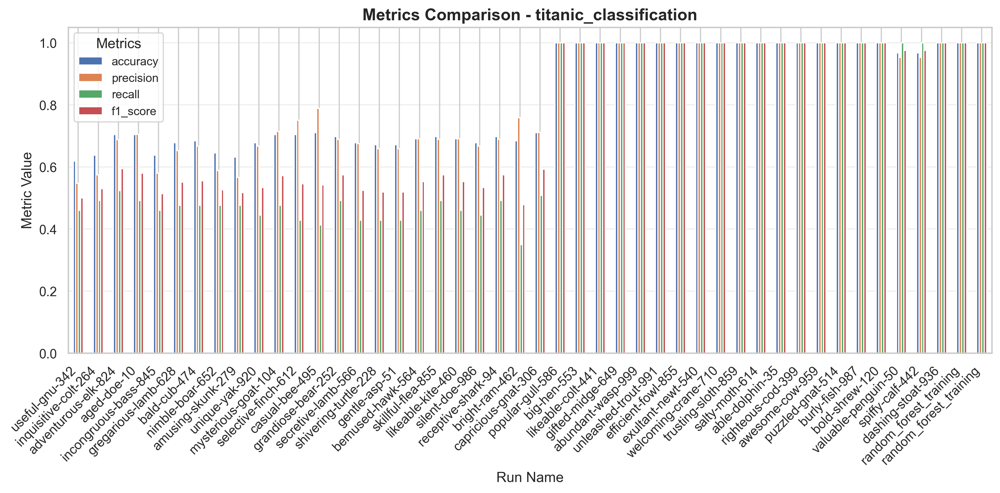
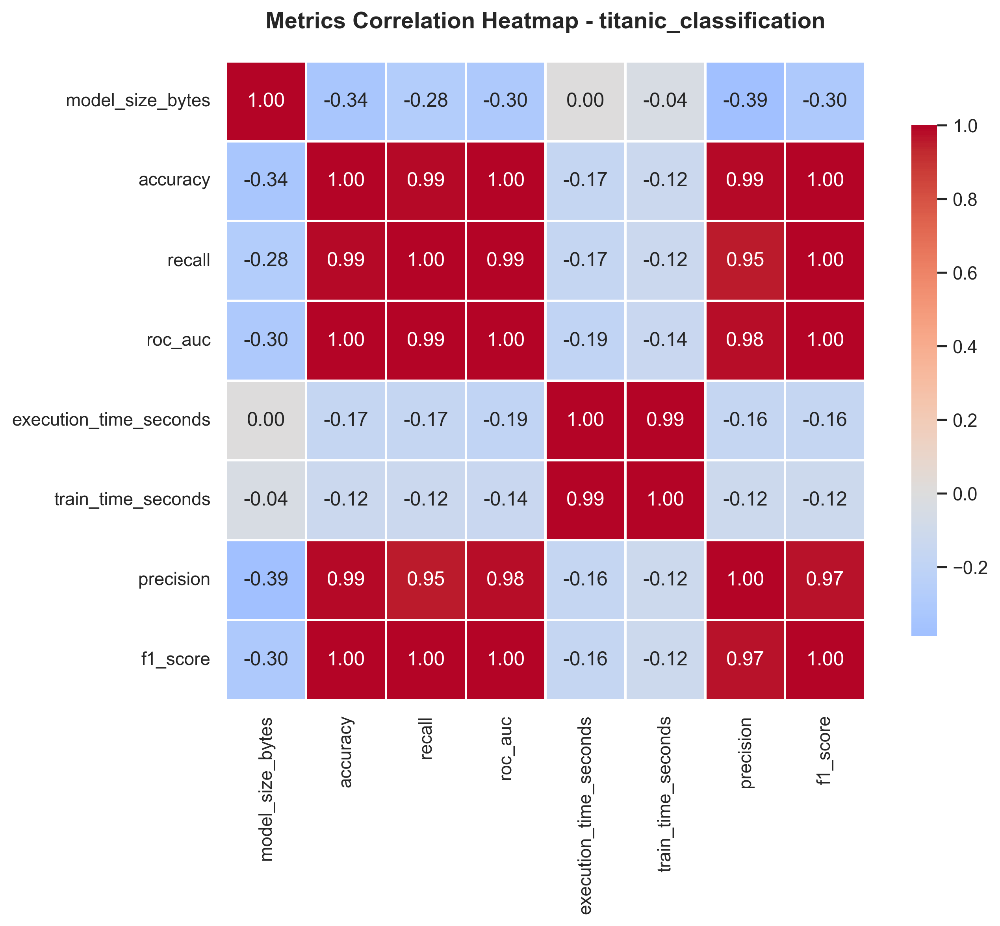
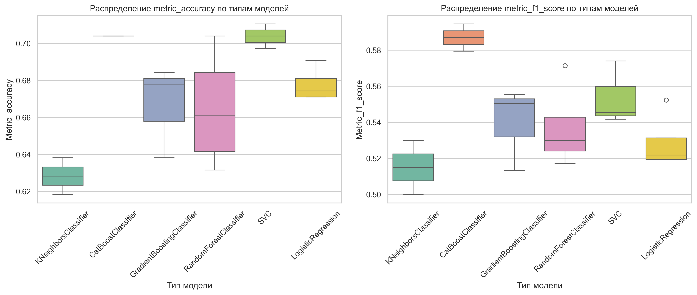
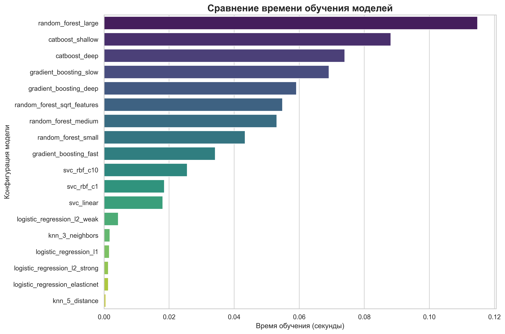
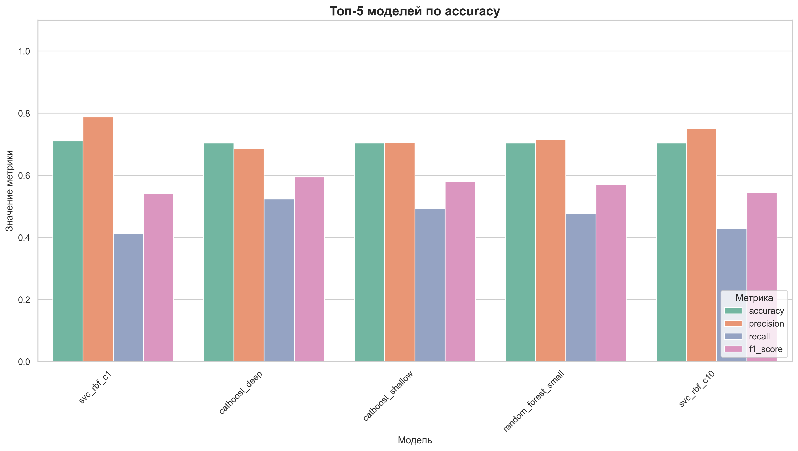

# Результаты экспериментов

Обзор результатов ML экспериментов на датасете Titanic.

## Обзор

В рамках проекта проведено **18 экспериментов** с различными ML моделями для задачи бинарной классификации (предсказание выживания пассажиров Titanic).

### Датасет

| Параметр | Значение |
|----------|----------|
| Исходный размер | 891 строка |
| После обработки | 757 строк |
| Признаков | 5 (age, sibsp, parch, fare, pclass) |
| Целевая переменная | Survived (0/1) |
| Распределение классов | 58.6% / 41.4% |

### Разделение данных

| Выборка | Размер | Пропорция |
|---------|--------|-----------|
| Train | 529 | 70% |
| Validation | 114 | 15% |
| Test | 114 | 15% |

---

## Исследуемые модели

| Тип модели | Количество конфигураций | Описание |
|------------|------------------------|----------|
| RandomForestClassifier | 4 | Различные n_estimators и max_depth |
| GradientBoostingClassifier | 3 | Различные learning_rate |
| CatBoostClassifier | 2 | Shallow и deep варианты |
| LogisticRegression | 4 | L1, L2, ElasticNet регуляризация |
| SVC | 3 | Linear и RBF kernels |
| KNeighborsClassifier | 2 | Разные k и веса |

---

## Лучшие результаты

### Топ-5 моделей по Accuracy

| Rank | Конфигурация | Тип модели | Accuracy | F1-Score | Precision | Recall |
|------|-------------|-----------|----------|----------|-----------|--------|
| 1 | svc_rbf_c1 | SVC | **0.7105** | 0.5417 | 0.7879 | 0.4127 |
| 2 | svc_rbf_c10 | SVC | 0.7039 | 0.5455 | 0.7500 | 0.4286 |
| 3 | random_forest_small | RandomForest | 0.7039 | 0.5714 | 0.7059 | 0.4800 |
| 4 | catboost_shallow | CatBoost | 0.7039 | 0.5794 | 0.6875 | 0.5000 |
| 5 | catboost_deep | CatBoost | 0.7039 | **0.5946** | 0.6471 | 0.5238 |

### Лучшие модели по каждой метрике

| Метрика | Модель | Значение |
|---------|--------|----------|
| **Accuracy** | SVC (RBF, C=1.0) | 0.7105 |
| **Precision** | SVC (RBF, C=1.0) | 0.7879 |
| **Recall** | CatBoost (deep) | 0.5238 |
| **F1-Score** | CatBoost (deep) | 0.5946 |

---

## Визуализации

### Сравнение метрик всех моделей



*Grouped bar chart — accuracy, precision, recall, f1_score для всех 18 моделей*

### Корреляция метрик



*Тепловая карта показывает корреляцию между различными метриками*

### Распределение по типам моделей



*Boxplot для сравнения accuracy и f1_score по типам алгоритмов*

### Время обучения



*Bar chart — время обучения каждой модели в секундах*

### Топ-5 моделей



*Grouped bar chart — все метрики для 5 лучших моделей по accuracy*

---

## Статистика экспериментов

### Общая статистика

| Показатель | Значение |
|------------|----------|
| Всего экспериментов | 18 |
| Успешно завершено | 18 (100%) |
| Общее время | ~30 секунд |
| Среднее время на эксперимент | ~1.6 сек |

### Диапазон метрик

| Метрика | Минимум | Максимум | Разброс |
|---------|---------|----------|---------|
| Accuracy | 0.618 | 0.711 | 9.3% |
| F1-Score | 0.500 | 0.595 | 9.5% |
| Время обучения | 1.36 сек | 2.37 сек | — |

---

## Выводы

### Производительность моделей

1. **Лучшая модель: SVC с RBF ядром (C=1.0)**
   - Accuracy: 0.7105 (лучшая среди всех)
   - Precision: 0.7879 (очень высокая — мало ложных срабатываний)
   - Recall: 0.4127 (невысокая — пропускает много выживших)
   - Компромисс: высокая точность, но консервативная модель

2. **Лучший F1-Score: CatBoost (deep)**
   - F1-Score: 0.5946 (лучший баланс precision/recall)
   - Accuracy: 0.7039
   - Самое быстрое обучение среди топ моделей (1.36 сек)

3. **Группы моделей:**
   - **SVC** — стабильно высокая accuracy (0.69-0.71)
   - **Tree-based** — хороший баланс метрик
   - **Linear** — средняя производительность (0.67-0.69)
   - **KNN** — худшая производительность (0.62-0.64)

### Рекомендации

**Для production:**

- **Accuracy важнее:** SVC RBF (C=1.0)
- **Баланс важнее:** CatBoost deep

**Для дальнейших экспериментов:**

- Feature engineering (создание новых признаков)
- Работа с дисбалансом классов (SMOTE, class weights)
- Ансамбли (VotingClassifier, Stacking)
- Кросс-валидация для более надёжной оценки

---

## Воспроизведение

```bash
# Запуск всех экспериментов
uv run python -m src.experiments.run_experiments --models all

# Анализ результатов
uv run python -m src.experiments.analyze_experiments --top-n 18

# Просмотр в MLflow UI
uv run mlflow ui --port 5000
```

Подробнее в [Воспроизводимость](../guides/reproducibility.md).
